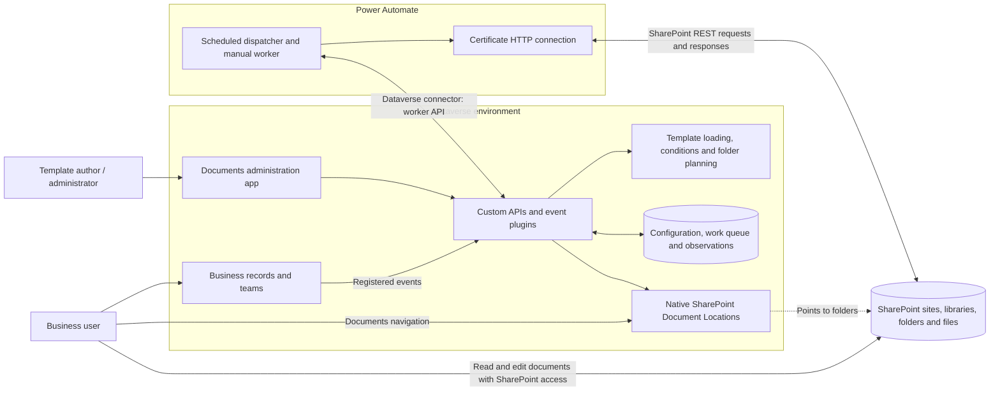
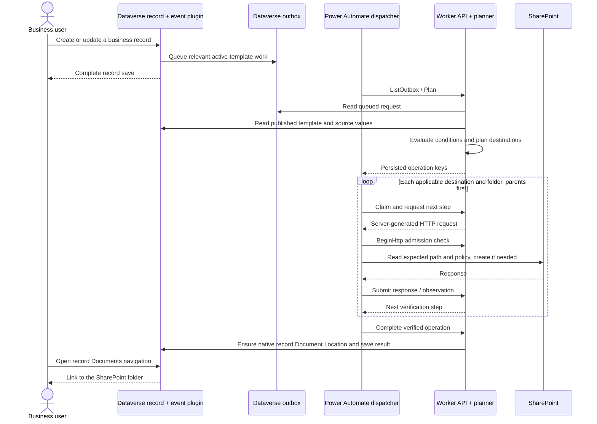
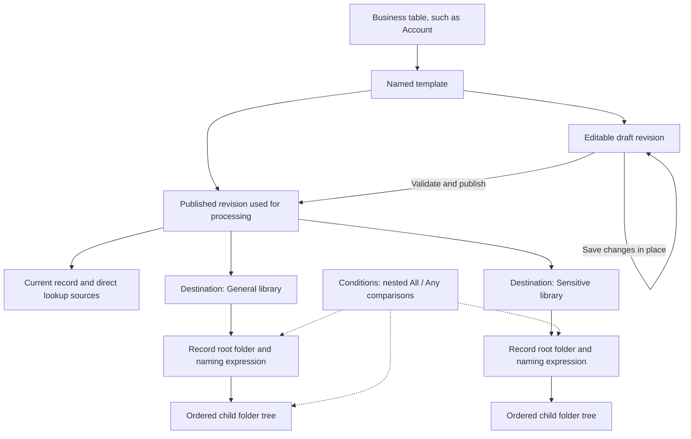
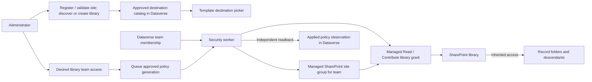
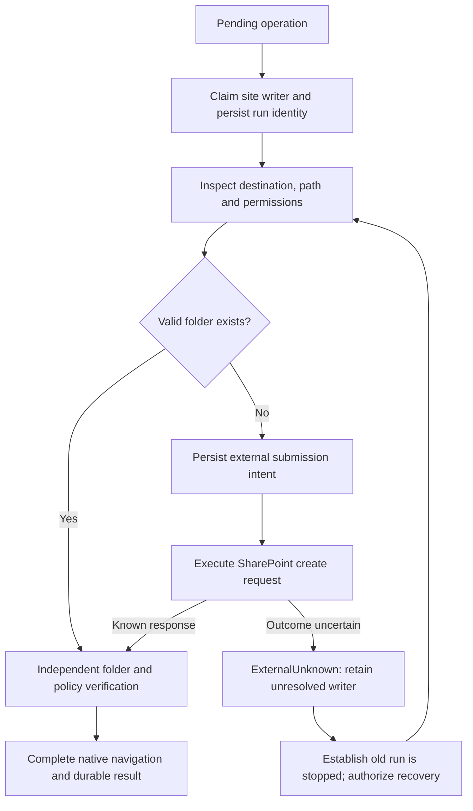
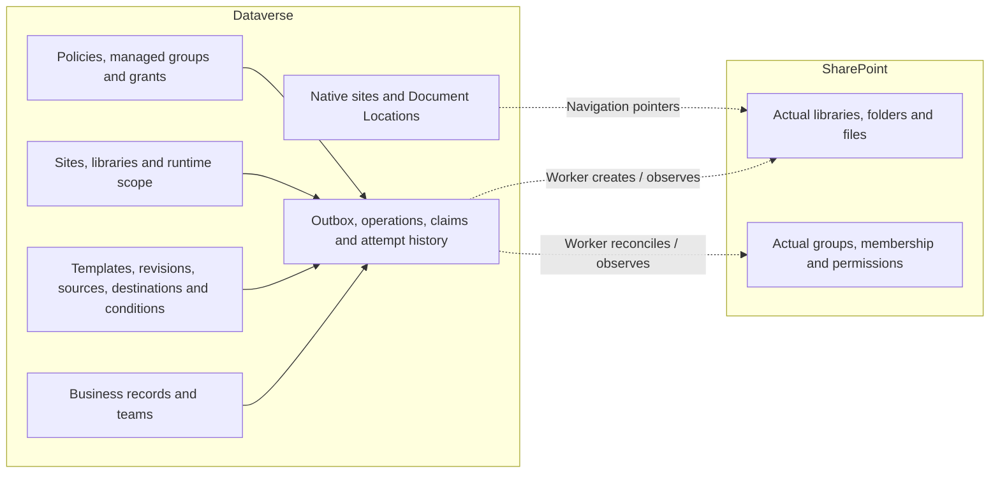

# How Ascentix Documents fits together

Source-based architecture guide · September 10, 2026

Ascentix Documents translates business records and published folder templates into SharePoint folders, then connects those folders to the record's native Documents navigation. It also translates approved Dataverse team access into SharePoint library permissions.

**Dataverse decides and remembers; Power Automate carries out SharePoint requests; SharePoint stores documents and enforces access.** The administration app is the interface for configuring and observing this process.

This guide describes the current checkout, using its `asx_` names. It is not a fresh audit of an installed environment. Older documents describe earlier designs and deployments, including the former `asxd_` prefix. The diagrams below describe responsibilities and implemented paths, not deployment acceptance results.

## 1. The overall system

The arrows to SharePoint represent two different identities: the worker performs setup using the configured application connection; people access documents using their own SharePoint permissions. A Document Location is a navigation link, not a copy of the files or a permission grant.

| Moving part | Responsibility | Where it runs |
|---|---|---|
| Administration app | Edit templates, preview and publish; manage sites, libraries, team access and runtime settings | Model-driven app with HTML/JavaScript web resources |
| Event plugins and custom APIs | Validate requests, enforce lifecycle/security rules, queue work and advance its state | Dataverse plugin execution |
| Conditions and planner | Evaluate configured record values and produce the applicable folder tree for each destination | .NET libraries invoked by Dataverse code |
| Durable work state | Remember pending work, claims, retries, observations and completion | Product tables in Dataverse |
| Dispatcher | Poll queued work and drive server-directed operations | Recurring Power Automate flow; schedule is every minute |
| Manual worker | Queue and process a specified template/record | Separate manually triggered Power Automate flow |
| HTTP connection | Execute the exact REST request supplied by the server | Power Automate connection reference |
| SharePoint | Store files/folders and enforce library access | SharePoint Online |

There is no separately hosted worker service in this design. “Worker” refers to the Power Automate flows together with the Dataverse worker API and coordinators. Azure DevOps builds and deploys components; it is outside the document-processing path. Ascentix Rules Engine is not an installed runtime dependency.

## 2. From saving a record to seeing its folders

Saving the business record queues work; SharePoint provisioning happens afterward. The event path requires configured registrations and an active published template. Updates are filtered for fields used by the template. Ordinary record editing does not require the user to manually write product queue rows.

One table can have multiple named templates. Each template can produce folders in several destinations simultaneously. For example, an Account template can produce a General folder in one library and a Sensitive folder in another. If one destination fails, another can already have completed; the overall record can therefore be partially provisioned.

The planner reads the current record and configured direct lookups, evaluates nested All/Any conditions and calculates names. A false parent condition suppresses its descendants; a false root suppresses that destination tree. Preview calculates a plan using the caller's access, without executing SharePoint requests.

## 3. What a template actually contains

The template is the long-lived identity. A revision is a version of its configuration. Repeated saves update the same draft; publication freezes the revision and moves the template's published pointer. Row-version checks detect conflicting edits. Draft changes do not change the published configuration until publication.

A destination chooses an approved site/library and entry path, then defines the record root and descendants. Library access is configured separately from the folder tree. Existing valid folders at the expected path can be reused regardless of who created them. A file occupying a folder path is a conflict. Reusing a folder can cause records to share documents, so naming is a business decision as well as a formatting choice.

Existing native record roots are reused to keep navigation stable. Template changes are additive provisioning instructions; they are not a request to rename, move or delete existing SharePoint content. Explicit replan is available for existing records; publishing alone should not be interpreted as a completed backfill.

## 4. Sites, libraries and team access

Site onboarding uses the shared worker to inspect SharePoint. Library creation is also a worker operation. The approved catalog records the verified destination identities and native navigation mapping; the template author selects from that catalog.

Team membership and library grants solve different problems. A managed SharePoint group represents the users of a Dataverse team at a site. A grant gives that group Read or Contribute on a particular library. The same group can serve multiple libraries, so removing one library grant must not empty a group still needed elsewhere.

**Desired** is what the administrator wants. **Queued** is the approved generation awaiting processing. **Applied** is what the worker has verified. Saving or queueing a policy does not mean SharePoint already enforces it. Membership events and scheduled security refresh feed reconciliation; removals require a complete membership read.

Permissions are assigned at the library boundary, and generated folders inherit them. Removing product-managed access does not remove access someone receives through other SharePoint groups, direct sharing or other grants. Dataverse record access and SharePoint document access are separate checks.

## 5. Why the worker repeatedly calls back to Dataverse

Dataverse and SharePoint do not share a transaction. SharePoint can create a folder even if its response is lost. The persisted claim, submission intent and later readback let the system distinguish a safe retry from an uncertain external write. A timeout or lease expiry alone cannot prove that an old SharePoint request has stopped.

Claims serialize writers for a site: each site has one writer at a time, which keeps its writes in order. Sites do not limit one another. HTTP admission applies shared pacing and shared `Retry-After` backoff across all writers. The solution flows run their loops serially and disable connector-level retries; the server coordinates retry decisions.

Transient reads can be rescheduled. Ambiguous writes retain state for controlled recovery. Completion is based on verification, rather than merely receiving a successful create response. Parent completion gates child work.

## 6. Where the information lives

Dataverse holds configuration and processing/access state; document bytes live in SharePoint. Native Document Locations are retained entry points for business records. The implementation avoids a permanent Dataverse inventory of every document and child folder: eligible terminal history is marked for retention after 30 days, purged in bounded batches, or compacted to retain current results. Unresolved external work is protected from routine cleanup.

## 7. Identity and deployment boundaries

| Boundary | What controls it |
|---|---|
| Person editing configuration | Dataverse roles, custom API authorization, revision and state guards |
| Person previewing a record | Initiating caller's Dataverse access |
| Background processing | Explicit runtime worker user and allowed source tables |
| Worker reaching SharePoint | Certificate HTTP connection, application permissions and selected-site grants, plus runtime host/native-site validation |
| Destination usable by a template | Product site/library approval and observed identity/policy checks |
| Person opening a document | That person's actual SharePoint permissions |

The flows use two solution connection references: `asx_documentsdataverse` and `asx_documentshttp`. The Dataverse worker user and SharePoint application connection have separate responsibilities even when installation setup relates them. Product catalog approval does not itself grant the application access to SharePoint.

Keep solution flows disabled during installation. Installation must bind connections, configure the approved runtime identity and scope, register business events, and enable processing. Build/deployment pipelines deliver the solution and components; they do not process each business record.

## 8. Source map and further reading

These are the implementation entry points used for this guide. Source links are relative to this file so they remain usable in the repository.

| Area | Source |
|---|---|
| Template administration | [admin.js](../client/admin/admin.js), [sites-access.js](../client/admin/sites-access.js) |
| Preview, publication and record events | [DocumentApis.cs](../src/Ascentix.Documents.Plugins/DocumentApis.cs), [WorkerOutboxAppend.cs](../src/Ascentix.Documents.Plugins/WorkerOutboxAppend.cs) |
| Draft persistence | [CreateDraftApi.cs](../src/Ascentix.Documents.Plugins/CreateDraftApi.cs), [draft lifecycle explanation](draft-save-lifecycle.md) |
| Conditions and folder planning | [Expressions.cs](../src/Ascentix.Documents.Conditions/Expressions.cs), [Planning.cs](../src/Ascentix.Documents.Domain/Planning.cs) |
| Worker routing and identity validation | [WorkerApis.cs](../src/Ascentix.Documents.Plugins/WorkerApis.cs), [RuntimeProfile.cs](../src/Ascentix.Documents.Dataverse/RuntimeProfile.cs) |
| Folder execution state machine | [WorkerCoordinator.cs](../src/Ascentix.Documents.Dataverse/WorkerCoordinator.cs) |
| Flow schedule and transport | [solution flows](../solution/AscentixDocuments/src/Workflows) |
| Site/library onboarding | [CatalogApproval.cs](../src/Ascentix.Documents.Dataverse/CatalogApproval.cs), [LibraryProvisioning.cs](../src/Ascentix.Documents.Dataverse/LibraryProvisioning.cs) |
| Team policies and membership | [SecurityAdministration.cs](../src/Ascentix.Documents.Dataverse/SecurityAdministration.cs), [SecurityWorker.cs](../src/Ascentix.Documents.Dataverse/SecurityWorker.cs), [SecurityRefresh.cs](../src/Ascentix.Documents.Dataverse/SecurityRefresh.cs) |
| Native navigation | [NativeLocations.cs](../src/Ascentix.Documents.Dataverse/NativeLocations.cs) |
| Concurrency and retention | [WorkCoordination.cs](../src/Ascentix.Documents.Dataverse/WorkCoordination.cs), [WorkRetention.cs](../src/Ascentix.Documents.Dataverse/WorkRetention.cs) |

For operational procedures see [operations](operations.md). See the [preview release notes](public-preview.md) for evaluation limits.
